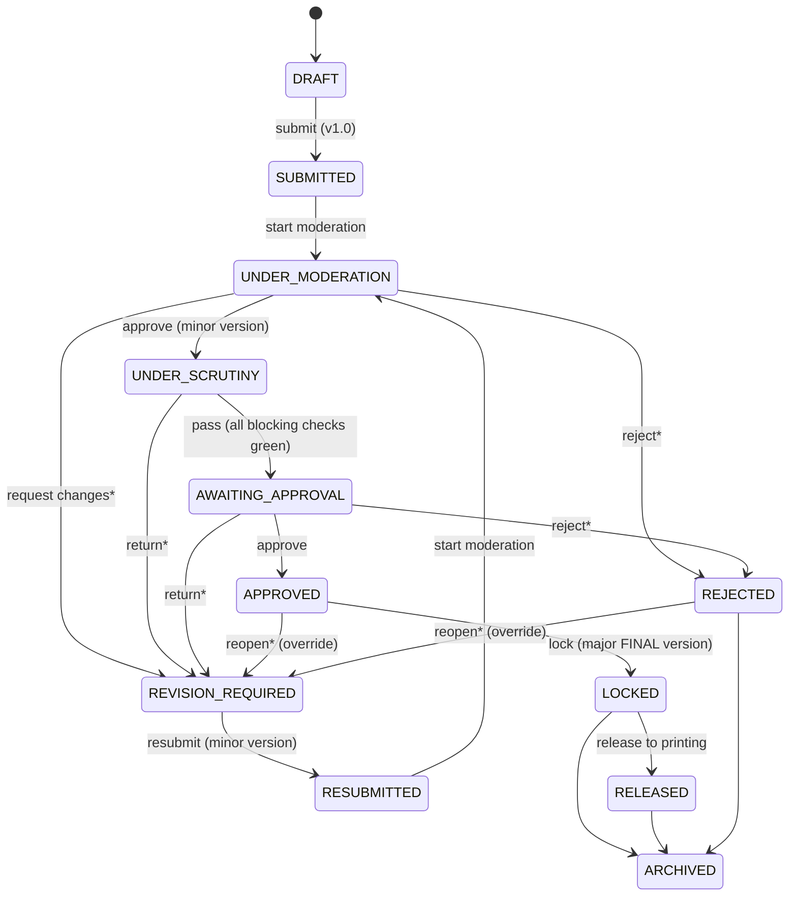

# EXAMCORE architecture

## Layers

```
Browser ── React Server Components (pages)       src/app/(app)/**
        ├─ Client components + server actions    src/features/**   (useActionState / runAction)
        └─ JSON API                              src/app/api/**    (api() wrapper)
                     │
                     ▼
     Server services (business logic, authorisation, audit)   src/server/services/**
        auth/current  → AuthContext { user, roles, grants (permission → scope) }
        auth/access   → where-builders (paperWhere, questionWhere…) + capability checks
                     │
                     ▼
     Pure domain modules (no I/O, fully unit-tested)           src/lib/domain/**
        permissions · workflow · blueprint · generator · similarity · scrutiny · diff · snapshot
                     │
                     ▼
     Prisma 7 (driver adapter: pg) → PostgreSQL
        + triggers (append-only tables, lock guard) · tsvector/GIN full-text · pg_trgm
```

Rules the codebase follows:

- **Pages read, actions write.** Every mutation goes through a service function that takes an `AuthContext`, checks permission and scope, runs in a transaction and writes an audit entry. Server actions use `runAction`, which maps errors to user-safe messages; API routes use `api()`.
- **Authorisation lives in the query.** List and detail loaders build their `where` from the caller's grants, so an unauthorised row is never loaded. This covers both `paperWhere(ctx)` and `questionWhere(ctx)`. An inaccessible ID is therefore indistinguishable from a missing one.
- **Domain logic is pure.** The workflow, generator, blueprint validation, similarity and scrutiny modules take plain data and return plain data. The server layer adds relations such as "is this user the assigned moderator?".
- **Server-only boundaries.** Server modules import `server-only`. Client bundles never contain secrets or services.

## Paper workflow

The state machine is defined in `src/lib/domain/workflow.ts` (`TRANSITIONS`). Each transition declares:

- its source states and target state;
- the permission required;
- the **actor relation** required: owner, assigned moderator, scrutinizer, approver, or examination authority;
- whether a note is mandatory;
- whether a version snapshot is taken.



`*` means a note is required.

The Approval screen performs *approve* and *lock* as one confirmed step. Each transition also:

- writes a `PaperTransition` row;
- writes an audit entry;
- sends notifications to the next actor.

**Versioning.**
- Snapshots are immutable `QuestionPaperVersion` rows: canonical JSON with a SHA-256 hash.
- Submission creates 1.0. Moderation and resubmission create 1.x. Lock creates *N*.0 **FINAL**.
- The final PDF is always rendered from the FINAL snapshot, never from live rows.
- **Compare** diffs any two versions (`src/lib/domain/diff.ts`).

**Edit rights.**
- The setter can edit only in `DRAFT` and `REVISION_REQUIRED`.
- The moderator can replace items only during `UNDER_MODERATION`, and each replacement is recorded.
- From `APPROVED` onward, a database trigger rejects any change to the paper's sections and items. This holds even if application code is bypassed.

## Question bank

- **Versioning:** each question has immutable `QuestionVersion` rows, and editing creates a new version. Papers reference questions; the snapshot freezes the text used.
- **Search:** a generated `tsvector` column with a GIN index gives ranked full-text search. `pg_trgm` word similarity provides typo tolerance (e.g. "stak" matches "stack"). Filters cover course, unit, marks, difficulty, Bloom level, type, tag, status and usage.
- **Duplicate detection** (`similarity.ts`):
  - It combines three scores: trigram similarity, TF-cosine similarity and concept overlap.
  - It runs when a question is authored and across a paper's items.
  - Its threshold is configurable.
- **Usage history:** `QuestionUsage` is append-only and is written when a paper is locked. It drives the reuse window. The generator refuses questions used within *N* sessions, and the builder flags them.

## Blueprint & generator

- A blueprint defines sections: question count, attempt count, marks per question, allowed types, unit coverage, and difficulty and Bloom distributions.
- `blueprint.ts` validates a paper against its blueprint, **weighted by marks**.
- `generator.ts` is greedy with a seeded PRNG, so results are reproducible and "regenerate" gives a new seed:
  - It fills each section while tracking marks-weighted deficits per unit, difficulty and Bloom level.
  - It excludes recently used, retired and duplicate-similar questions.
  - It reports shortfalls instead of silently under-filling.

## Automated scrutiny

`scrutiny.ts` runs on the snapshot and returns blocking checks and warnings:

- course, duration and marks match the examination;
- section totals match the blueprint;
- numbering is continuous;
- instructions are present;
- equations compile (KaTeX), with a check for unbalanced `$`;
- referenced images exist;
- MCQ options are distinct and complete;
- no invisible or bidi characters;
- no setter name or "Answer:" text leaks;
- a watermark policy is active.

The *Pass scrutiny* action is refused server-side unless every blocking check passes.

## Documents, packaging & files

- `src/server/pdf/render.ts` renders the same React `PaperDocument` used for the on-screen preview to HTML, then prints it with headless Chromium. It adds headers and footers ("Page x of y") and a watermark overlay: viewer name, timestamp and CONFIDENTIAL / DRAFT / MODERATION COPY.
- Packaging: `pdf-lib` merges papers into print batches, and JSZip builds a package with a manifest of SHA-256 hashes. The package is stored encrypted like every other file.
- Stored files are AES-256-GCM encrypted (`storage.ts`) and served only via `/api/files/:id`, with an HMAC-signed, expiring URL, an authorisation re-check and an audit entry.

## Security model

| Concern | Implementation |
|---|---|
| Passwords | Argon2id (`@node-rs/argon2`); policy from settings (length, character classes, must not contain name/e-mail/employee ID) |
| Brute force | Per-IP limit (30/min) and per-identifier failure window; account lockout after `maxFailedLogins`; generic error messages |
| Sessions | Random 256-bit token, stored hashed (SHA-256) in `Session`; HttpOnly, SameSite=Lax cookie, `__Host-` prefix in production; idle timeout and absolute expiry; revocable |
| MFA | TOTP (RFC 6238) with an encrypted secret; roles listed in *Security → Require MFA* are blocked from paper content until enrolled |
| CSRF | `proxy.ts` rejects mutating `/api` requests whose `Origin` ≠ `APP_URL`; server actions carry Next.js's built-in origin check |
| Headers | CSP (`default-src 'self'`, no third-party origins; `script-src` still allows `'unsafe-inline'` for Next.js bootstrap — moving to per-request nonces is a recommended hardening step), `frame-ancestors 'none'`, HSTS (prod), `X-Content-Type-Options`, `Referrer-Policy`, `Permissions-Policy` |
| Authorisation | Permission + department scope per role grant; scope enforced in queries; actor relations enforced in the workflow (self-moderation/approval impossible) |
| Integrity | Audit log hash chain (`hash = sha256(prevHash ‖ canonical entry)`) under an advisory lock; DB triggers make `AuditLog`, `QuestionVersion`, `QuestionPaperVersion`, `QuestionUsage` and `PaperTransition` append-only; the lock guard trigger freezes approved papers |
| Content safety | Question content is a restricted markdown subset, parsed to a whitelist AST, with no raw HTML |
| Confidentiality | No paper content in notifications or e-mails (pointers only); per-viewer watermarks; the Super Admin holds every permission by institution policy (see authorization.md); the IT Admin has no paper/question permissions |

## Role matrix (verified)

Results of the automated walkthrough against the seeded dev database, where each role signed in and requested each page:

- ✓ = page loads.
- — = refused and redirected to *Access restricted*.

Where a page is refused, its API returns 403 or an empty, scoped list.

| Page | Admin | Controller | Deputy | Exam cell | Approver | Auditor | HoD | Setter | Moderator | Scrutiny |
|---|---|---|---|---|---|---|---|---|---|---|
| Dashboard | ✓ | ✓ | ✓ | ✓ | ✓ | ✓ | ✓ | ✓ | ✓ | ✓ |
| Papers | — | ✓ | ✓ | — | ✓ | — | ✓ | ✓ (own) | ✓ (assigned) | ✓ |
| Question bank | — | ✓ | ✓ | — | — | — | ✓ | ✓ | ✓ | — |
| Assignments (setter inbox) | — | — | — | — | — | — | ✓ | ✓ | — | — |
| Moderation | — | — | — | — | — | — | — | — | ✓ | — |
| Scrutiny | — | — | — | — | — | — | — | — | — | ✓ |
| Approvals | — | ✓ | — | — | ✓ | — | — | — | — | — |
| Examinations | ✓ | ✓ | ✓ | ✓ | ✓ | ✓ | ✓ | — | — | — |
| Setters | — | ✓ | ✓ | ✓ | — | — | ✓ | — | — | — |
| Packaging | — | ✓ | ✓ | — | — | — | — | — | — | — |
| Archive | — | ✓ | ✓ | — | ✓ | — | ✓ | — | — | — |
| Reports | ✓ | ✓ | ✓ | ✓ | ✓ | ✓ | ✓ | — | — | — |
| Analytics | ✓ | ✓ | ✓ | — | — | ✓ | — | — | — | — |
| Audit | ✓ | ✓ | — | — | — | ✓ | — | — | — | — |
| Administration | ✓ | — | — | — | — | — | — | — | — | — |
| Templates | ✓ | ✓ | — | — | — | — | — | — | — | — |

Workflow and abuse checks covered by the integration suite (`tests/integration/workflow.test.ts`):

- invalid transitions;
- a setter approving their own paper;
- a moderator acting on an unassigned paper;
- cross-department access (IDOR);
- editing a locked paper or a FINAL version, which the DB triggers reject;
- the audit chain remaining intact.

Cross-origin POSTs, self-approval and IDOR were additionally verified by hand against the running API.
