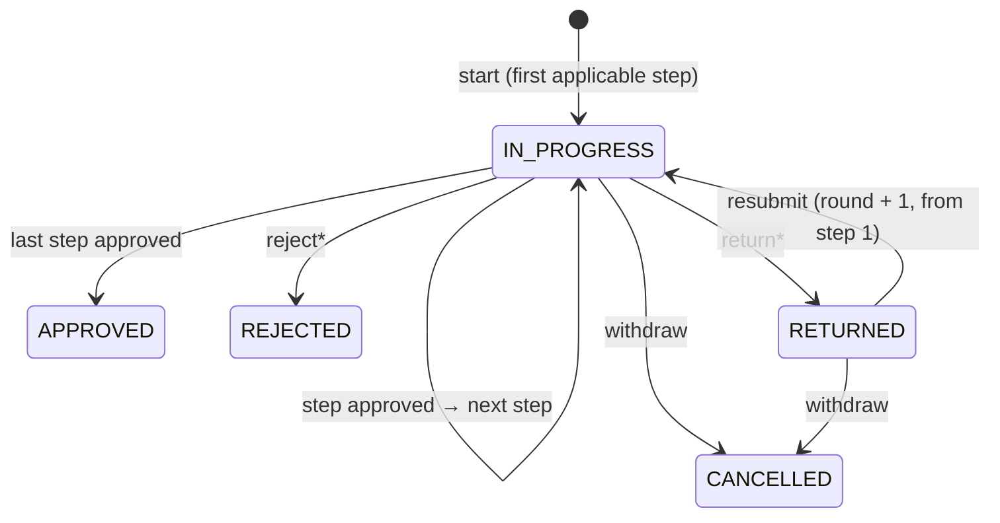

# Workflow engine

One configurable approval engine serves every module. The exception is question papers, whose dedicated state machine is described in [question-paper-system.md](question-paper-system.md).

## Concepts

| Entity | Purpose |
|---|---|
| `WorkflowDefinition` | Versioned list of steps for a workflow key such as `access.request`. Publishing an edit creates a new version. Running requests keep the version they started with. |
| `WorkflowInstance` | One request: the record it concerns (`resourceType`/`resourceId`), the subject department (drives approver scope), the subject person, the request data (drives conditions), status, current step and round. |
| `WorkflowTask` | One approver's task for one step in one round. |
| `WorkflowAction` | Append-only history (a DB trigger forbids UPDATE and DELETE). |
| `WorkflowDelegation` | Out-of-office routing of new tasks to a colleague for a period. |

## Step definition

```json
{
  "key": "hod",
  "name": "Head of department review",
  "approvers": [{ "type": "role", "role": "HOD", "scope": "subject_department" }],
  "mode": "ANY",
  "condition": { "field": "days", "op": "gt", "value": 3 },
  "slaHours": 48,
  "escalateToRole": "DEAN",
  "allowReturn": true,
  "allowDelegate": true
}
```

- **Approvers**:
  - `role` with `subject_department` scope: holders whose grant covers the request's department (department, unit or campus grants all count);
  - `role` with `global` scope: any holder;
  - `user`: a named person;
  - `data_user`: the user whose id is in a field of the request data (for example `managerUserId`, the applicant's reporting manager on leave requests). Nothing is assigned when the field is empty, so pair it with a condition.
- **Mode**:
  - `ANY`: the first decision wins.
  - `ALL`: parallel approval. Every approver must approve; any rejection or return decides immediately.
- **Condition**: `eq neq gt gte lt lte in notIn exists` on a path into the request data. Conditions combine with `{ "all": [...] }` and `{ "any": [...] }`. Steps whose condition is false are skipped.
- **SLA and escalation**: the worker's `workflow.escalate` job runs every 15 minutes. It flags overdue tasks once, notifies the assignee and adds tasks for holders of `escalateToRole`.

## Lifecycle



`*` means a reason is required.

Rules enforced by the service (`src/server/services/workflow.ts`):

- A record can have only one open request at a time.
- A task can be decided only by its assignee, and only once. Decisions are serialised per task with an advisory lock.
- The requester and the subject are never approvers. A step with no independent approver is skipped and logged. A step with no configured approver at all fails with a clear configuration error.
- Every decision writes a task update, a history action, an audit entry, notifications and a `WorkflowCompleted` domain event on completion.
- Completion hooks (`onApproved`, `onRejected`, …) run **in the same transaction** as the final decision, so "approved" and "role granted" commit together.

## Adding a workflow to a module

1. Create `src/server/workflow/modules/<name>.ts` and call `registerWorkflow({ key, name, module, description, defaultSteps, details, href, onApproved, … })`.
2. Import it from `src/server/workflow/modules/index.ts`.
3. In the module's service, create the record and call `startWorkflow(tx, actor, { key, resourceType, resourceId, title, departmentId, subjectUserId, data })` inside the same transaction.

The definition appears under *Configuration centre → Workflows*, where administrators can change steps, approvers, conditions and SLAs, or switch the workflow off.

## Screens

- `/inbox`: Approval centre. Tasks waiting for me, decided by me and my requests, plus counts from the examination queues.
- `/inbox/[taskId]`: request context, approval path, history, and approve / return / reject / delegate.
- `/inbox/requests/[id]`: the requester's view, with withdraw.
- `/inbox/delegations`: out-of-office delegation.
- `/admin/workflows`: definitions, versions, open and overdue counts, and the step editor.
